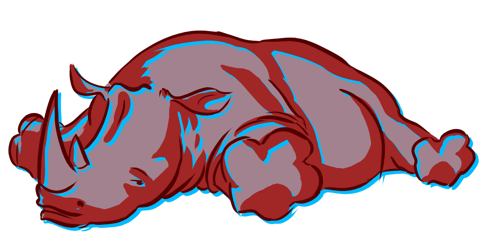
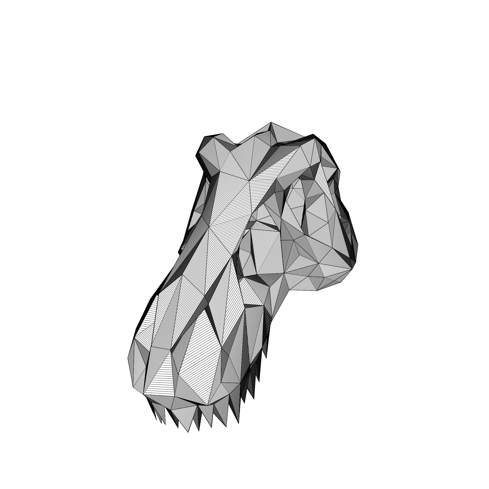
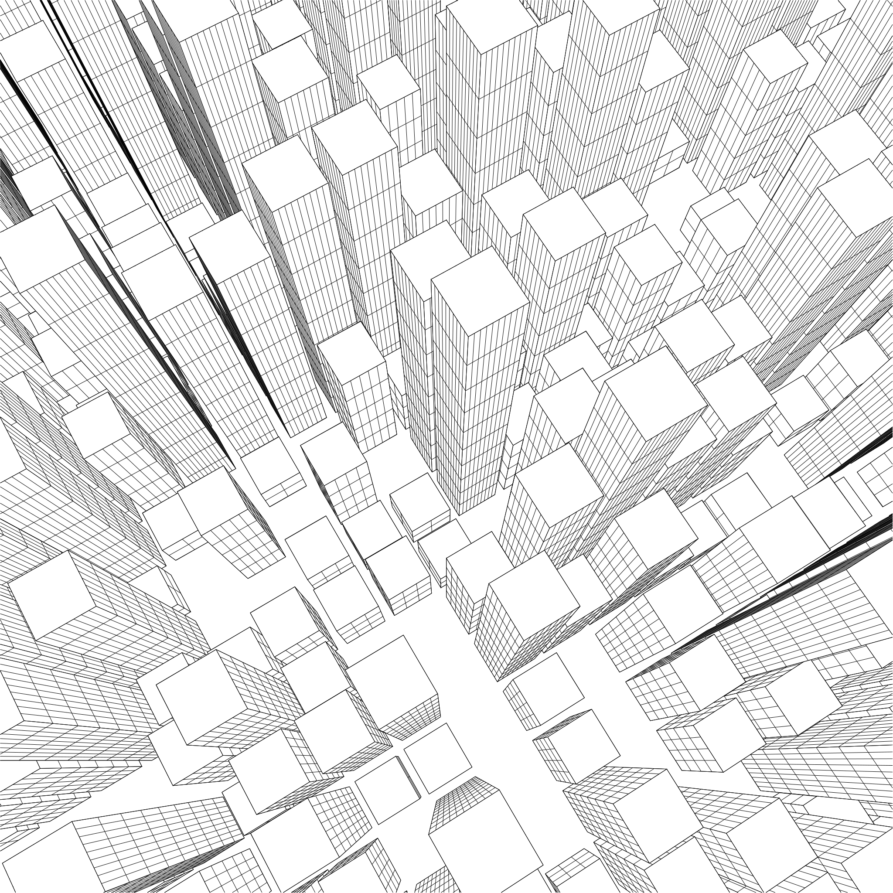
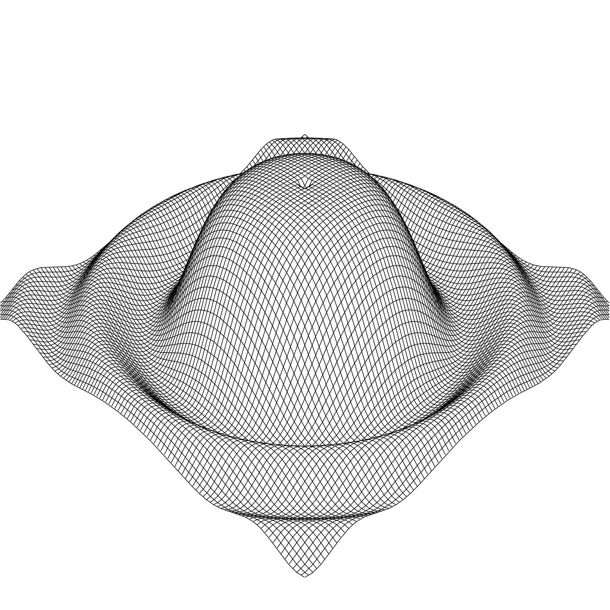
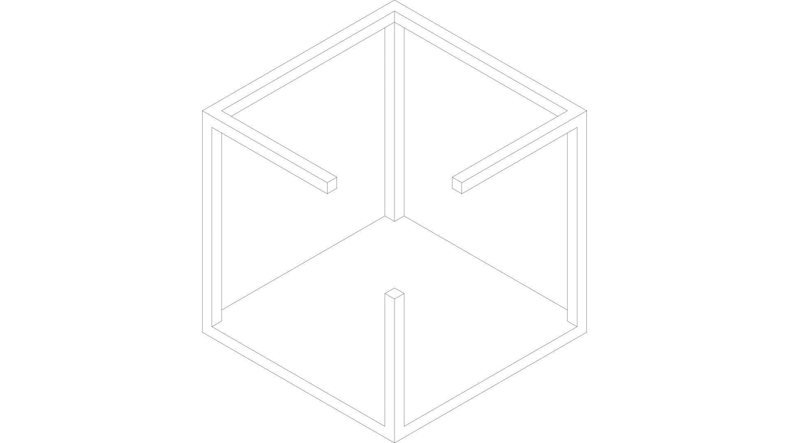
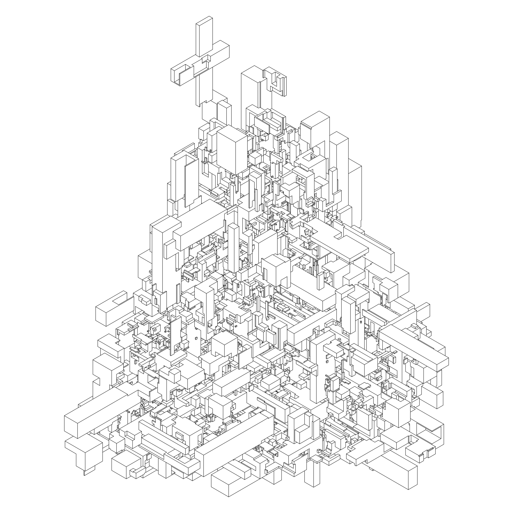
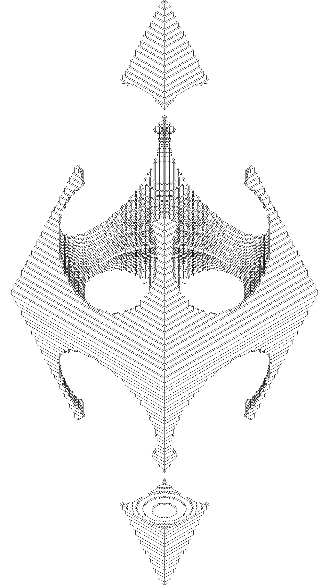

# R3d

My Rust playground to learn more about 3D graphics and renderers.

## Buzz, the ray tracer

`buzz` is a ray tracer that is able to render simple geometric primitives such
as spheres, cubes and planes as well as triangle meshes. It supports direct and
indirect lighting, as well as soft shadows and it uses a very simple model to
represent materials.

Lastly, it also has a primitive implementation of a framework to model and
render 3D objects using the Constructive Solid Geometry approach.

It has been heavily inspired by
https://github.com/petershirley/raytracinginoneweekend.

## L, the line renderer

`l` is a line renderer that is able to render lines lying on 3D objects with
hidden line removal. It supports very basic geometries like cubes, but also
functions and triangle meshes.

## Ivo, the isometric voxel renderer

`ivo` is an isometric voxel renderer that is quite limited, for instance it does
not support arbitrary cameras, but it is fun to play with anyhow.

