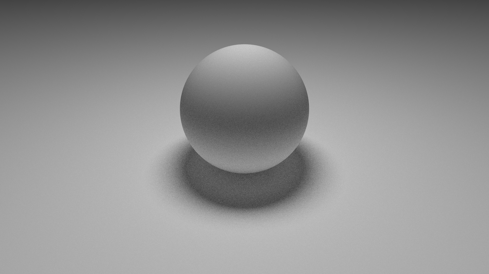
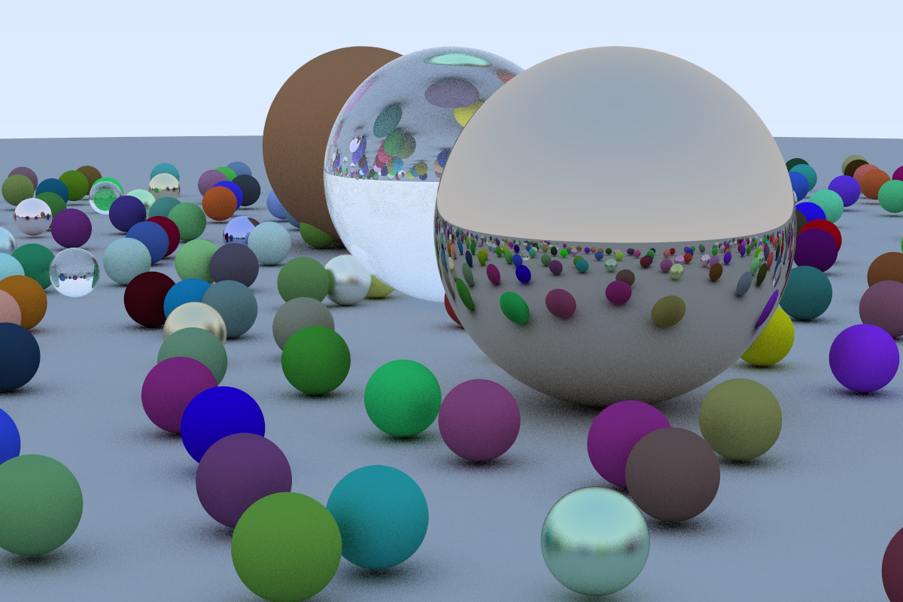
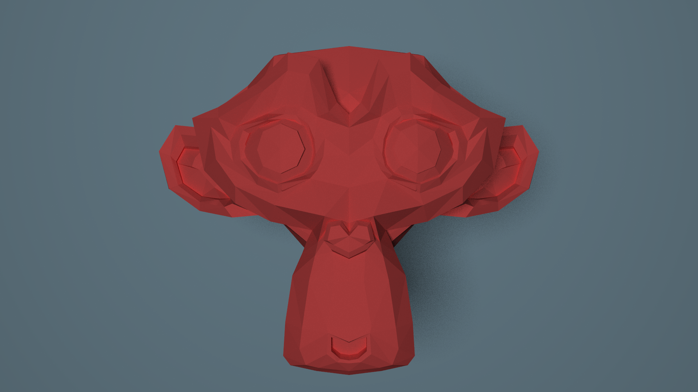
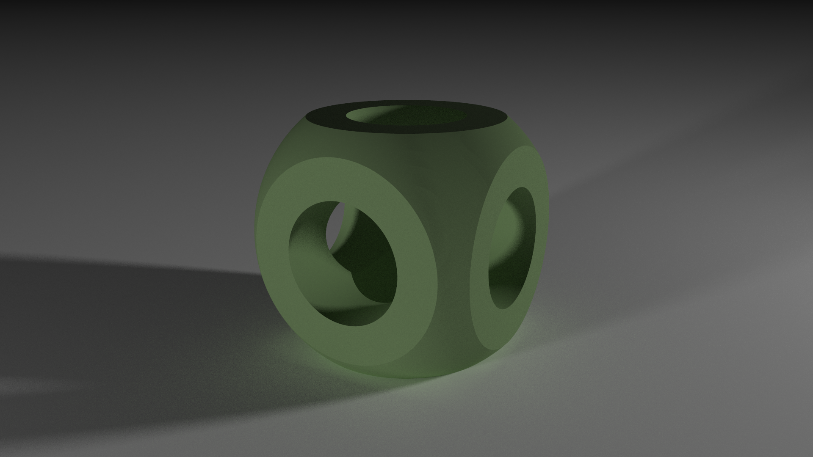

# R3d

My Rust playground to learn more about 3D graphics and renderers.

## Buzz, the ray tracer

`buzz` is a simple ray tracer that is able to render simple geometric primitives
such as spheres, cubes and planes as well as triangle meshes. It supports direct
and indirect lighting, as soft shadows and uses a very simple model to represent
materials.

Lastly, it also has a primitive (and buggy)
implementation of a simple framework to model and render 3D objects using the
Constructive Solid Geometry approach.

It has been heavily inspired by
https://github.com/petershirley/raytracinginoneweekend.

To run yourself some of the examples:

```bash
$ cargo run --release --example hello
$ cargo run --release --example suzanne
$ cargo run --release --example rtiw-cover
```






